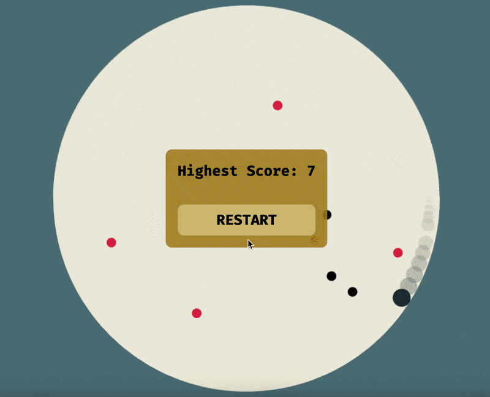

# Gravity Ball Game ⬇️🎾⬇️

**Welcome to the Gravity Game!**

In this game, you will hold the mouse right click button to increase gravity and release the right click button to bring gravity back to normal. 

Your goal is to press and release the gravity at the right time to build up or release momentum as the ball rolls inside a circle. You will need to use this momentum to try to hit the food in the middle while avoiding obstacles. Can you master the gravity and score a high score? Give it a try and find out!

Here is a quick demo:

 

***Backstory***:

This is the project I built for my AP Computer Science Principles performance task. And I somehow got a perfect score on the exam 😲.